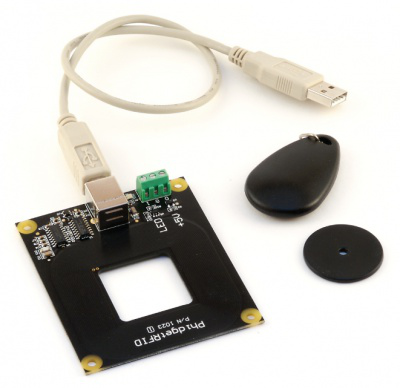

# Wallet Project
 
This is my final year project devoloping a location awareness system which tracks the movement of an object(wallet) inside a closed enviroment.

## Description
Developing a tracking system that is able to track the movement of an object indoor with the addition of extra features to enhance the user’s experience. The Graphical user interface of this tracking system is based on java application. It allows the user to see the current location of the chosen object dynamically when its current position changes, adding a new one, updating an existing object or even deleting it.

## Visuals
The Technology used for this project as shown in the picture is the RFID reader with the tag.
Where the reader reads and captures information stored on a tag attached to an object which is the wallet through the radio waves.

Below is a demo of how the tracking system works, showing all the functionlaities with how the user's name is displayed once it's detected by a reader.

## Installation
I will be talking you through the required software to run the system. Eclipse is the development enviroment used to build up this project. So the project application can be running off this software, it can be downloaded from [here](https://www.eclipse.org/downloads/).
Java Software is also needed and you can get it [here](https://www.java.com/en/download/). Lastly to interact with the RFID readers, there is a software to download online and you can get it by following this [link](https://www.phidgets.com/docs/Phidgets_Drivers).

Now there are two parts for the project, the server and the client. Apache Tomcat is a java servlet that should be hosted and running to transfer the data to the database, validate it and bring it back to the client.
In order to run the server, you need to donwload it from this [link](https://tomcat.apache.org/download-90.cgi). Then click on PhidgetServer project, servlets, run SensorServerRFIDdata.

Now, the server should be up and running, but the RFID readers are still offline. go to JavaFX_GUI_Project, readers, there will be 3 reader classess and you need to run them all in order to trun them on. 

The next step is to display the User Interface in order to interact with the system. Go to Main and run the main class as Java Application and you're all set.

## Support
If you have any issues with the project and want to get help, or even having an idea to enhance/add something I am always happy to hear from you via emails on : yamenadel4@gmail.com .

## Roadmap
My current plan is working on how far the tag is from the reader, this would give an extra information of the user's current location.

## Contributing
Pull requests are welcome. For major changes, please open an issue first to discuss what you would like to change in the application. Please feel free to email me in regards any contribution you would like to add using my email address above in support section. Follow this [link](https://github.com/YamenEdel/Wallet_Project) to download the repository on GitHub. 
